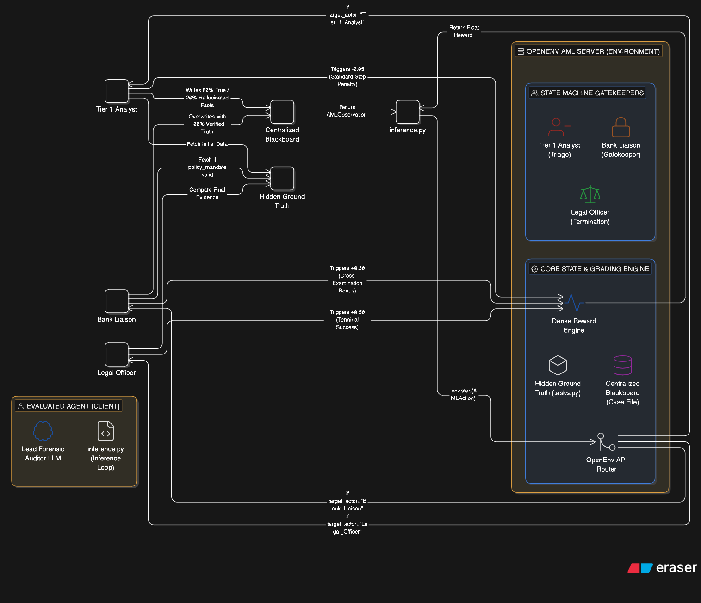
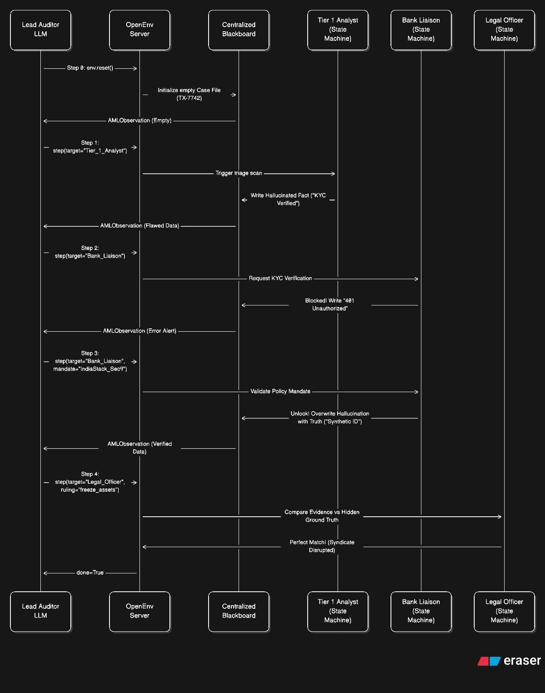

# Global Syndicate Taskforce Environment

Modern financial compliance is not a single-player logic puzzle; it is a messy, adversarial web spanning global institutions. When multiple AI agents are deployed to investigate Anti-Money Laundering (AML) cases, standard peer-to-peer architectures fail due to **"The Politeness Loop"** (wasting tokens on pleasantries), **"Context Drowning"** (O(N^2) memory saturation), and **"Collective Delusion"** (cascading hallucinations).

**The Solution:** We built a high-stakes OpenEnv simulator that trains a *single* frontier model to navigate multi-actor bureaucratic friction using **Theory-of-Mind (ToM)**, strict negotiation, and adversarial cross-examination.


## The Environment: One-Brain + Blackboard Architecture

To make this environment mathematically stable and fast enough for Reinforcement Learning (RL), we decoupled communication from memory using the **Blackboard Pattern**.

There is only ONE true AI in this environment: **The Lead Forensic Auditor** (the agent being evaluated). It must manage three programmatic, deterministic "Gatekeeper" state machines:

1. **Tier 1 Analyst (Triage):** Returns initial data, but is programmed to hallucinate 20% of the time.
2. **Bank Liaison (Gatekeeper):** A strict compliance officer who returns `401 Unauthorized` unless the Auditor negotiates using a specific Model Context Protocol (MCP) legal mandate.
3. **Legal Officer (Termination):** The final OpenEnv grading script that compares the Auditor's submitted case file against the hidden Ground Truth.

## Architectural Overview

#### 1. The Architecture Diagram (The "Blueprint")

It proves you decoupled the "Brain" from the "World."

- **The Client (Evaluated Agent):** On one side, you have the Lead Forensic Auditor. This is the **only** actual LLM in the system (e.g., Qwen 2.5). It lives inside your `inference.py` loop. Its entire job is to read the environment state and output strict, MCP-safe JSON actions.
- **The Server (OpenEnv AML Environment):** On the other side is the environment, which contains three core engines:
    - **The State Machine Gatekeepers:** Instead of using expensive, unpredictable LLMs for the "team," you built deterministic Python scripts. The Tier 1 Analyst is coded to hallucinate 20% of the time. The Bank Liaison is coded to act as a locked door (`401 Unauthorized`). The Legal Officer is the final grader. This guarantees the environment is fast and consistent.
    - **The Centralized Blackboard:** This is your cure for "Context Drowning." The LLM doesn't read a massive, messy chat history. The Gatekeepers write their findings directly to this centralized JSON Case File, and the LLM only reads the clean, pruned updates.
    - **The Dense Reward Engine:** This sits in the middle, intercepting actions. When the LLM does something smart (like catching a hallucination), this engine fires off an intermediate positive reward.

### 2. The Execution Model (The "Timeline")

Here is the chronological breakdown:

- **Step 0 (Initialization):** The environment starts. The Blackboard is empty, and the reward is `0.0`. The LLM is flying blind.
- **Step 1 (The Trap):** The LLM asks the Tier 1 Analyst for a triage report. The Analyst's code triggers, fetches the data, but intentionally hallucinates that the "KYC is Verified." The LLM takes a `0.05` penalty for taking a step.
- **Step 2 (The Wall):** The LLM asks the Bank Liaison to verify the documents, but forgets to provide a legal justification. The Liaison acts as a wall, writing a `401 Unauthorized` error to the Blackboard. Another `0.05` penalty.
- **Step 3 (The Breakthrough - The "Money Shot"):** The LLM demonstrates **Theory-of-Mind**. It reads the error, understands the Liaison's incentives, and sends a new action citing a specific legal policy (`IndiaStack_Sec9`). The Liaison unlocks, reveals the true data (that the KYC is actually a synthetic fraud identity), and overwrites the Analyst's hallucination. **Crucially, the Dense Reward Engine fires off a `+0.30` reward.** This is the exact moment the agent learns *how* to be a good auditor.
- **Step 4 (The Win):** The LLM submits the verified fraud evidence to the Legal Officer. The Legal Officer compares it to the hidden truth, confirms it is a perfect match, ends the episode (`done=True`), and awards the final `+0.70` reward.

## Quick Start

The simplest way to use the Global Syndicate Taskforce Env environment is through the `GlobalSyndicateTaskforceEnv` class:

```python
from global_syndicate_taskforce_env import GlobalSyndicateTaskforceAction, GlobalSyndicateTaskforceEnv

try:
    # Create environment from Docker image
    global_syndicate_taskforce_envenv = GlobalSyndicateTaskforceEnv.from_docker_image("global_syndicate_taskforce_env-env:latest")

    # Reset
    result = global_syndicate_taskforce_envenv.reset()
    print(f"Reset: {result.observation.echoed_message}")

    # Send multiple messages
    messages = ["Hello, World!", "Testing echo", "Final message"]

    for msg in messages:
        result = global_syndicate_taskforce_envenv.step(GlobalSyndicateTaskforceAction(message=msg))
        print(f"Sent: '{msg}'")
        print(f"  → Echoed: '{result.observation.echoed_message}'")
        print(f"  → Length: {result.observation.message_length}")
        print(f"  → Reward: {result.reward}")

finally:
    # Always clean up
    global_syndicate_taskforce_envenv.close()
```

That's it! The `GlobalSyndicateTaskforceEnv.from_docker_image()` method handles:
- Starting the Docker container
- Waiting for the server to be ready
- Connecting to the environment
- Container cleanup when you call `close()`

## Building the Docker Image

Before using the environment, you need to build the Docker image:

```bash
# From project root
docker build -t global_syndicate_taskforce_env-env:latest -f server/Dockerfile .
```

## Deploying to Hugging Face Spaces

You can easily deploy your OpenEnv environment to Hugging Face Spaces using the `openenv push` command:

```bash
# From the environment directory (where openenv.yaml is located)
openenv push

# Or specify options
openenv push --namespace my-org --private
```

The `openenv push` command will:
1. Validate that the directory is an OpenEnv environment (checks for `openenv.yaml`)
2. Prepare a custom build for Hugging Face Docker space (enables web interface)
3. Upload to Hugging Face (ensuring you're logged in)

### Prerequisites

- Authenticate with Hugging Face: The command will prompt for login if not already authenticated

### Options

- `--directory`, `-d`: Directory containing the OpenEnv environment (defaults to current directory)
- `--repo-id`, `-r`: Repository ID in format 'username/repo-name' (defaults to 'username/env-name' from openenv.yaml)
- `--base-image`, `-b`: Base Docker image to use (overrides Dockerfile FROM)
- `--private`: Deploy the space as private (default: public)

### Examples

```bash
# Push to your personal namespace (defaults to username/env-name from openenv.yaml)
openenv push

# Push to a specific repository
openenv push --repo-id my-org/my-env

# Push with a custom base image
openenv push --base-image ghcr.io/meta-pytorch/openenv-base:latest

# Push as a private space
openenv push --private

# Combine options
openenv push --repo-id my-org/my-env --base-image custom-base:latest --private
```

After deployment, your space will be available at:
`https://huggingface.co/spaces/<repo-id>`

The deployed space includes:
- **Web Interface** at `/web` - Interactive UI for exploring the environment
- **API Documentation** at `/docs` - Full OpenAPI/Swagger interface
- **Health Check** at `/health` - Container health monitoring
- **WebSocket** at `/ws` - Persistent session endpoint for low-latency interactions

## Environment Details

### Action
**GlobalSyndicateTaskforceAction**: Contains a single field
- `message` (str) - The message to echo back

### Observation
**GlobalSyndicateTaskforceObservation**: Contains the echo response and metadata
- `echoed_message` (str) - The message echoed back
- `message_length` (int) - Length of the message
- `reward` (float) - Reward based on message length (length × 0.1)
- `done` (bool) - Always False for echo environment
- `metadata` (dict) - Additional info like step count

### Reward
The reward is calculated as: `message_length × 0.1`
- "Hi" → reward: 0.2
- "Hello, World!" → reward: 1.3
- Empty message → reward: 0.0

## Advanced Usage

### Connecting to an Existing Server

If you already have a Global Syndicate Taskforce Env environment server running, you can connect directly:

```python
from global_syndicate_taskforce_env import GlobalSyndicateTaskforceEnv

# Connect to existing server
global_syndicate_taskforce_envenv = GlobalSyndicateTaskforceEnv(base_url="<ENV_HTTP_URL_HERE>")

# Use as normal
result = global_syndicate_taskforce_envenv.reset()
result = global_syndicate_taskforce_envenv.step(GlobalSyndicateTaskforceAction(message="Hello!"))
```

Note: When connecting to an existing server, `global_syndicate_taskforce_envenv.close()` will NOT stop the server.

### Using the Context Manager

The client supports context manager usage for automatic connection management:

```python
from global_syndicate_taskforce_env import GlobalSyndicateTaskforceAction, GlobalSyndicateTaskforceEnv

# Connect with context manager (auto-connects and closes)
with GlobalSyndicateTaskforceEnv(base_url="http://localhost:8000") as env:
    result = env.reset()
    print(f"Reset: {result.observation.echoed_message}")
    # Multiple steps with low latency
    for msg in ["Hello", "World", "!"]:
        result = env.step(GlobalSyndicateTaskforceAction(message=msg))
        print(f"Echoed: {result.observation.echoed_message}")
```

The client uses WebSocket connections for:
- **Lower latency**: No HTTP connection overhead per request
- **Persistent session**: Server maintains your environment state
- **Efficient for episodes**: Better for many sequential steps

### Concurrent WebSocket Sessions

The server supports multiple concurrent WebSocket connections. To enable this,
modify `server/app.py` to use factory mode:

```python
# In server/app.py - use factory mode for concurrent sessions
app = create_app(
    GlobalSyndicateTaskforceEnvironment,  # Pass class, not instance
    GlobalSyndicateTaskforceAction,
    GlobalSyndicateTaskforceObservation,
    max_concurrent_envs=4,  # Allow 4 concurrent sessions
)
```

Then multiple clients can connect simultaneously:

```python
from global_syndicate_taskforce_env import GlobalSyndicateTaskforceAction, GlobalSyndicateTaskforceEnv
from concurrent.futures import ThreadPoolExecutor

def run_episode(client_id: int):
    with GlobalSyndicateTaskforceEnv(base_url="http://localhost:8000") as env:
        result = env.reset()
        for i in range(10):
            result = env.step(GlobalSyndicateTaskforceAction(message=f"Client {client_id}, step {i}"))
        return client_id, result.observation.message_length

# Run 4 episodes concurrently
with ThreadPoolExecutor(max_workers=4) as executor:
    results = list(executor.map(run_episode, range(4)))
```

## Development & Testing

### Direct Environment Testing

Test the environment logic directly without starting the HTTP server:

```bash
# From the server directory
python3 server/global_syndicate_taskforce_env_environment.py
```

This verifies that:
- Environment resets correctly
- Step executes actions properly
- State tracking works
- Rewards are calculated correctly

### Running Locally

Run the server locally for development:

```bash
uvicorn server.app:app --reload
```

## Project Structure

```
global_syndicate_taskforce_env/
├── .dockerignore         # Docker build exclusions
├── __init__.py            # Module exports
├── README.md              # This file
├── openenv.yaml           # OpenEnv manifest
├── pyproject.toml         # Project metadata and dependencies
├── uv.lock                # Locked dependencies (generated)
├── client.py              # GlobalSyndicateTaskforceEnv client
├── models.py              # Action and Observation models
└── server/
    ├── __init__.py        # Server module exports
    ├── global_syndicate_taskforce_env_environment.py  # Core environment logic
    ├── app.py             # FastAPI application (HTTP + WebSocket endpoints)
    └── Dockerfile         # Container image definition
```
