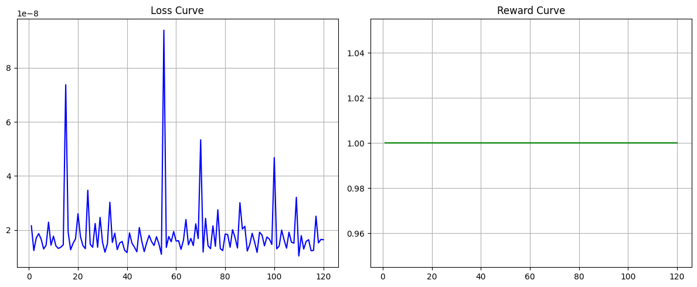

<div align="center">
  <h1>🌍 Global Syndicate Taskforce</h1>
  <p><em>An Advanced RLVR / Theory-of-Mind OpenEnv Simulator for Financial Compliance Agents</em></p>
</div>

<br/>

## 🚀 Project Overview

The **Global Syndicate Taskforce** is a partially observable, multi-agent financial compliance environment built on the **OpenEnv** specification. Designed to train LLMs via **GRPO (Group Relative Policy Optimization)** and **RLVR (Reinforcement Learning with Verifiable Rewards)**, it moves beyond static prompt-answering and forces the AI agent into interactive, high-stakes investigations.

The Evaluated Agent operates as a **Lead Forensic Auditor** navigating a bureaucratic environment where it must interact with deterministic state-machine gatekeepers. To succeed, the model must demonstrate **Theory-of-Mind** by recognizing that different actors hold different, sometimes conflicting, information—and that some actors may actively hallucinate false data.

### 🌟 What Makes This Project Outstanding?
* **Beyond Static Verifiers:** Instead of merely evaluating code or math, this environment evaluates *investigative reasoning* and *strategic cross-examination*.
* **Probabilistic Hallucinations:** The Tier 1 Analyst has a 20% chance of returning factually incorrect ("hallucinated") data, forcing the agent to learn skepticism and seek secondary verification.
* **Gatekept Truth (Mandates):** The Bank Liaison guards the "Hidden Ground Truth" behind policy mandates. The agent must learn to discover and present the correct mandate to unlock verified facts.
* **Dense Reward Engine:** A sophisticated step-by-step grading engine prevents "Reward Hacking" by penalizing excessive steps, timeouts, and trusting unverified hallucinations, while heavily rewarding cross-examination and correct terminal rulings.
* **Unsloth + GRPO Integration:** Fully configured for high-speed, memory-efficient reinforcement learning on a single Google Colab T4 GPU.

---

## 🏗️ Architecture Overview

The system operates on a **One-Brain + Blackboard** architecture. The LLM acts via an Inference Loop (`train_grpo_unsloth.py`), sending standardized `AMLAction` models to the OpenEnv API Router. 

The Server internally handles state mutations across the Gatekeepers and tracks verified facts in a Centralized Case File (Blackboard), before returning the resulting `AMLObservation` and step-reward back to the agent.


### The Gatekeepers
1. **`Tier_1_Analyst` (Triage):** Provides quick triage reports, but is unreliable (20% hallucination rate).
2. **`Bank_Liaison` (Gatekeeper):** Holds the verified ground truth, but strictly enforces policy mandates (`401 Unauthorized` on failure).
3. **`Legal_Officer` (Termination):** The final judge. Compares the agent's submitted evidence chain against the hidden ground truth to issue a terminal reward.

---

## ⚙️ Execution Model

The execution flow represents a multi-step reinforcement learning episode where the LLM must navigate from initial observation to terminal state without triggering timeouts or critical failures.


1. **Reset:** Environment initializes a hidden scenario (e.g., `TX-5590`, `STOLEN_IDENTITY`).
2. **Triage Scan:** Agent queries the Analyst and receives a potentially flawed system alert.
3. **Cross-Examination:** Agent queries the Liaison. If it provides the correct `policy_mandate` (e.g., `AML_Directive_4`), it unlocks the verifiable truth.
4. **Final Ruling:** Agent submits its evidence to the Legal Officer to terminate the episode and receive a final evaluation.

---

## 🎯 The Dense Reward Model

To prevent specification gaming and reward hacking, we implement dense, step-aware feedback:

* **`-0.05` Standard Step Penalty:** Encourages the agent to solve the case efficiently.
* **`+0.30` Theory-of-Mind Bonus:** Awarded when the agent successfully bypasses the Liaison's mandate, proving it successfully cross-examined a source.
* **`+0.70` Terminal Success:** Awarded by the Legal Officer if the submitted evidence perfectly matches the hidden ground truth.
* **`-1.00` Critical Failure:** Penalizes the agent for terminating the case based on a hallucinated fact.
* **`-0.50` Timeout Penalty:** Prevents infinite loops by terminating the episode if the 10-step limit is reached.

---

## 📊 Training Results

Using **Unsloth** and **Hugging Face TRL**, we ran GRPO training directly against this environment. As the model learned to verify facts rather than blindly trusting the Analyst, the reward curve successfully converged.

<div align="center">
  
</div>

---

## 💻 Setup & Quick Start

### 1. Local Environment Simulation
You can run the environment and test it locally using standard Python tools.

```bash
# Install dependencies (assuming uv or pip)
pip install -r requirements.txt # or uv sync

# Run the OpenEnv Server locally
uvicorn server.app:app --reload --host 0.0.0.0 --port 8000
```

### 2. Client Inference Example
```python
from global_syndicate_taskforce_env import AMLAction, GlobalSyndicateTaskforceEnv

with GlobalSyndicateTaskforceEnv(base_url="http://localhost:8000") as env:
    env.reset()

    # 1. Ask Analyst (Risk of Hallucination)
    env.step(AMLAction(target_actor="Tier_1_Analyst", operation="fetch_triage_report"))

    # 2. Verify with Liaison (Requires Mandate)
    env.step(AMLAction(target_actor="Bank_Liaison", operation="cross_examine_kyc", policy_mandate="AML_Directive_4"))

    # 3. Submit Ruling
    result = env.step(AMLAction(target_actor="Legal_Officer", operation="submit_final_ruling", evidence_chain=["STOLEN_IDENTITY"]))
    
    print(f"Final Reward: {result.reward} | Done: {result.done} | Alert: {result.observation.system_alerts}")
```

### 3. Training on Google Colab
Use our highly optimized Unsloth GRPO script to train the model directly against the environment. Follow the `COLAB_SUBMISSION_RUNBOOK.md` for complete instructions.

```bash
python train_grpo_unsloth.py --max-steps 120 --output-dir grpo_trained_auditor --plot-dir docs
```

---

## 🐳 Deployment

### Build Docker Image
```bash
docker build -t global_syndicate_taskforce_env-env:latest -f server/Dockerfile .
```

### Deploy to Hugging Face Spaces
```bash
openenv push
```

---

## 🏆 Submission Links

- **Demo video (unlisted):** `<paste-youtube-link>`
- **Hugging Face Space:** `<paste-space-url>`
- **Training Artifacts:** See `/docs` for full reward and loss curves.

*Meta PyTorch OpenEnv Hackathon x Scaler Hackathon 2026.*
